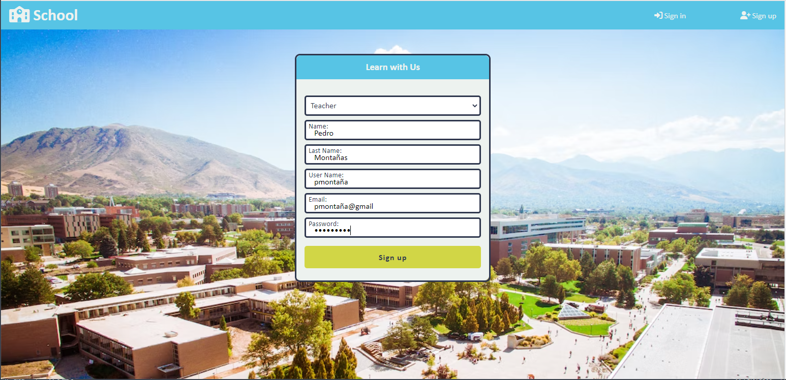
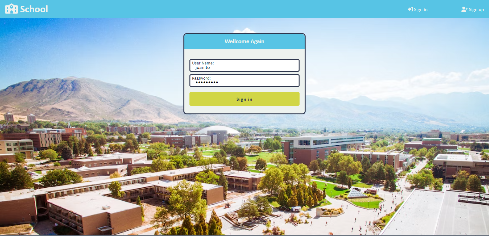
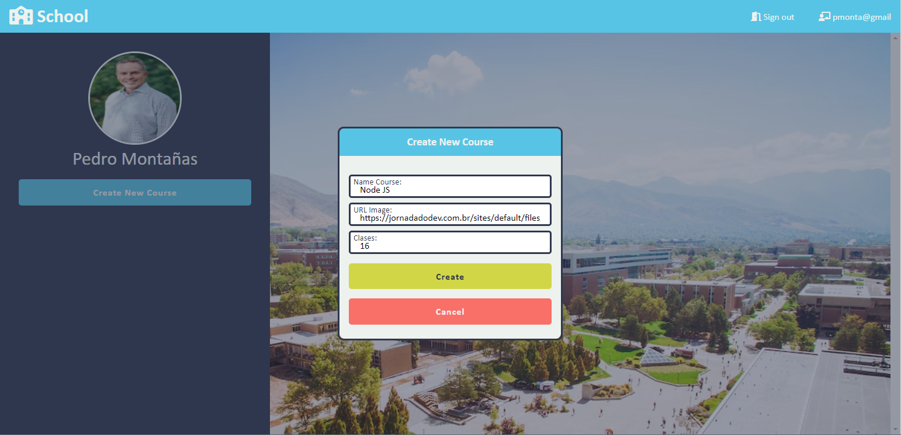
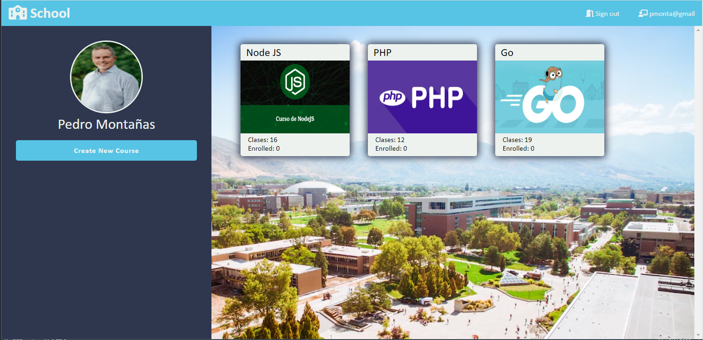
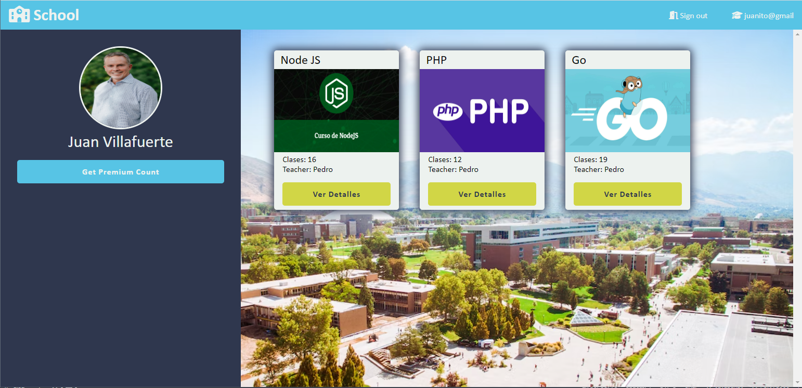
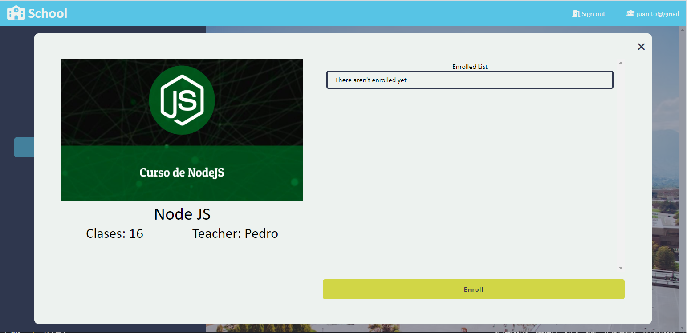
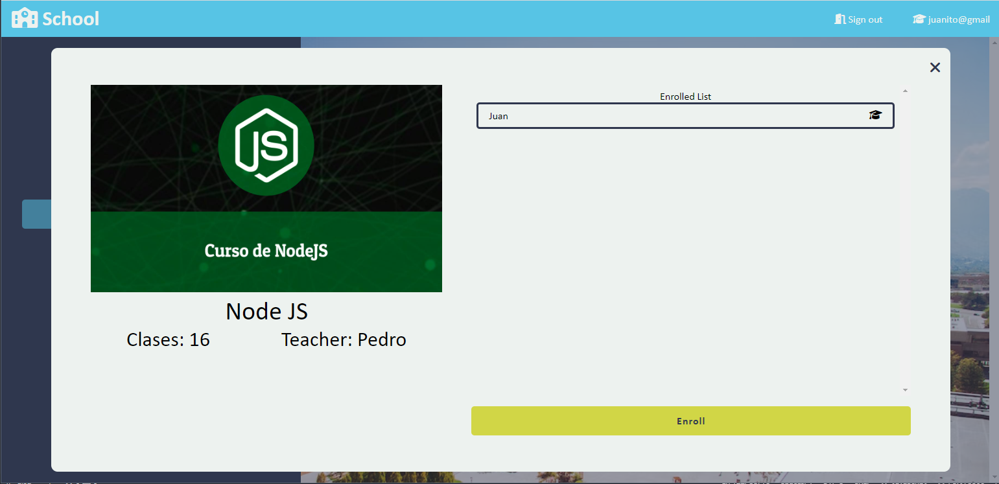

# Aplicacion escolar V.1.0

Esta es un aplicación escolar en la cual se pueden registrar profesores y estudiantes, cada un ocon diferentes funciones.
* profesores: pueden crear nuevos cursos
* estudiantes: pueden inscribirse en los cursos  

> Nota: esta es una aplicación de práctica, la intecion fue practicar los conceptos del paradicma POO (programacion orientado a objetos), tambien se hizo uso de "json-server" para simular un bakend. esta es la primera version de la app, aun hay varios errores que seran solucionados en una segunda version. pero por el momento funciona 😁

## Capturas de Pantalla

**Registro**

---
**Inicio de Sesión**

---
**Profesor - crear curso**

---
**Profesor - Lista de cursos**

---
**Estuddiante**

>*nota: no busque otra imagen de perfil para el estudiante*
---

**Estuddiante - ver detalles**

---
**Estuddiante - matriculado**

>*nota: se me olvido agregar el boton para que estudiante se desinscriba del curso*
---

Las imagenes de los cursos fueron extraidas de google imagenes, el resto se obtuvo de [Unsplash](https://unsplash.com/es "unsplash home page") y los iconos de [Font Awesome](https://fontawesome.com/icons "font awesome icons page")